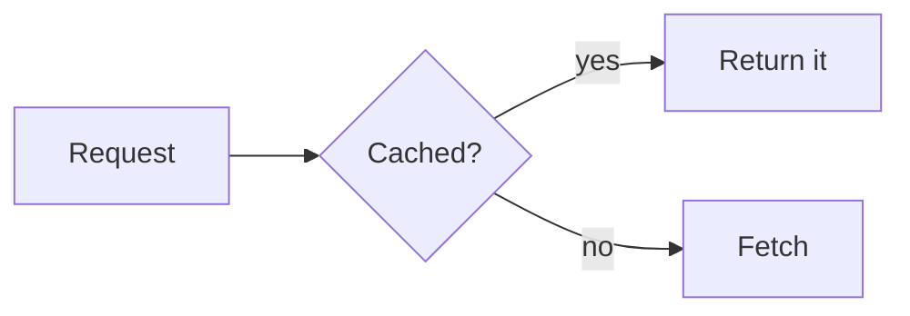

# Mermaid diagrams

LLMs draw diagrams as [Mermaid](https://mermaid.js.org) code blocks:

````markdown

````

Confluence can't draw these on its own: it needs an app installed on the site. rfluence uploads a ```` ```mermaid ```` block in the best form your site supports.

## What your site needs

| Installed on the site | A ```` ```mermaid ```` block becomes |
| --- | --- |
| [merfluence](https://github.com/edlopez000/merfluence) | a merfluence diagram (the source is inside the diagram) |
| [Mermaid Diagrams Viewer](https://marketplace.atlassian.com/apps/1232887/mermaid-diagrams-viewer) (Atlassian Labs) | a collapsed **Mermaid source** expand holding the code, followed by the viewer's macro, which draws it |
| neither | a code block (language `mermaid`): readable, but not drawn |

Installing an app is up to a Confluence admin. With neither installed, nothing breaks: the diagrams stay code blocks, and become diagrams the next time the page is uploaded after an app is installed.

## How rfluence decides

On every upload with a Mermaid block:

1. If the page already has a merfluence diagram, rfluence uses that app.
2. Otherwise it asks Confluence which apps the site has: merfluence first, then Mermaid Diagrams Viewer, else a code block.

Every diagram on a page uses the same app. If rfluence can't ask (the lookup fails), it uploads code blocks and warns: `Mermaid diagrams are uploaded as code blocks`.

## Editing diagrams

Edit the ```` ```mermaid ```` block in the markdown; that's the whole diagram, whichever app draws it. When you fetch a page:

- merfluence diagrams come back as ```` ```mermaid ```` blocks;
- Mermaid Diagrams Viewer diagrams that rfluence uploaded come back as ```` ```mermaid ```` blocks too (the expand and the macro are one diagram in markdown);
- `--simplified` shows every diagram as a ```` ```mermaid ```` block.

Viewer diagrams made by hand in Confluence's editor are an exception. The editor doesn't link the code block to its macro the way rfluence does, so they come back as the code block (in a `<details>` if it was in an expand) followed by an ```` ```adf ```` block for the macro. Keep the two together: the macro draws the Mermaid code block that comes in the same position on the page.

## Settings (merfluence)

merfluence takes settings after `mermaid` on the opening line:

````markdown
```mermaid theme=dark useMaxWidth=false
````

`theme`, `mermaidVersion` and `useMaxWidth=false` are kept and fetched back. Mermaid Diagrams Viewer has no settings: on a site that uses it, they're dropped (with a warning).

## Where diagrams can go

The viewer's expand is only allowed at the top level of a page and in layout columns. A Mermaid block inside a list, a table or a quote is uploaded as a code block on such sites.

## When a diagram doesn't show

- **It's a code block on the page**: the site has no Mermaid app, or rfluence couldn't check (look for the warning). Ask an admin to install one, then upload again.
- **The viewer says it can't find the code block**: its macro draws the Mermaid code block in the same position. Something separated them (a code block deleted or moved in the editor). Fetch the page, check each diagram's code is right before its macro, and upload; or re-create it from a ```` ```mermaid ```` block.
- **An edited merfluence diagram shows the old picture**: that happens when a diagram keeps its old pre-rendered images with new source. rfluence never uploads those images, so diagrams it uploads are always drawn from their source.
