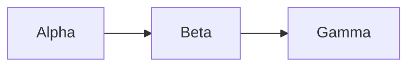
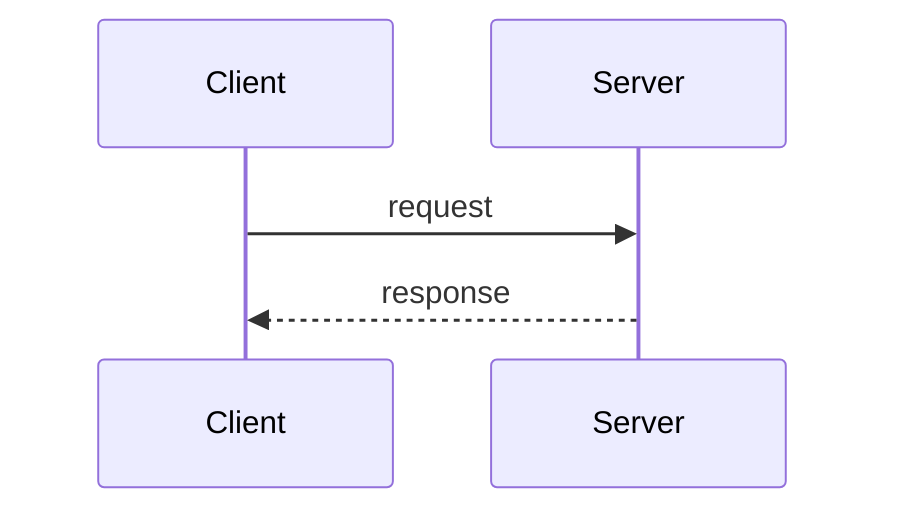
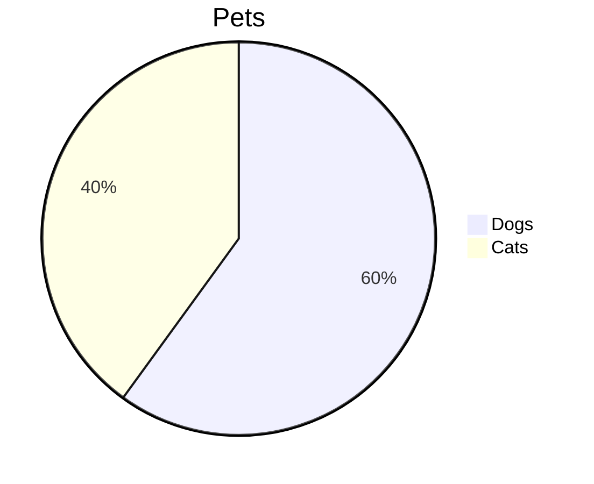

rfluence test page: checks whether merfluence renders diagrams created via the API. Safe to delete.

## A: source only

Expected: flowchart Alpha -\> Beta -\> Gamma

## B: source + default settings

Expected: sequence diagram Client -\> Server

## C: new source + stale cached SVGs

Expected if source wins: pie chart. Stale if it shows the Start/Is it?/Rethink flowchart.

