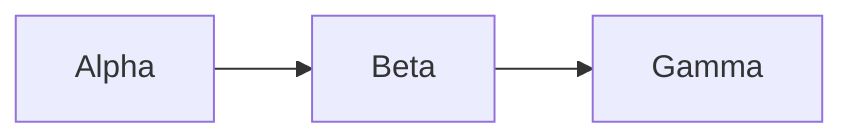
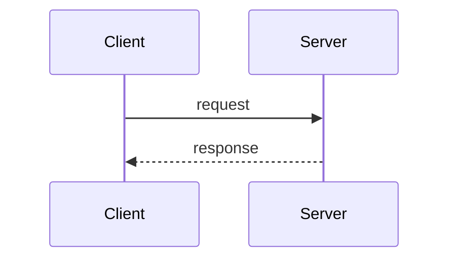
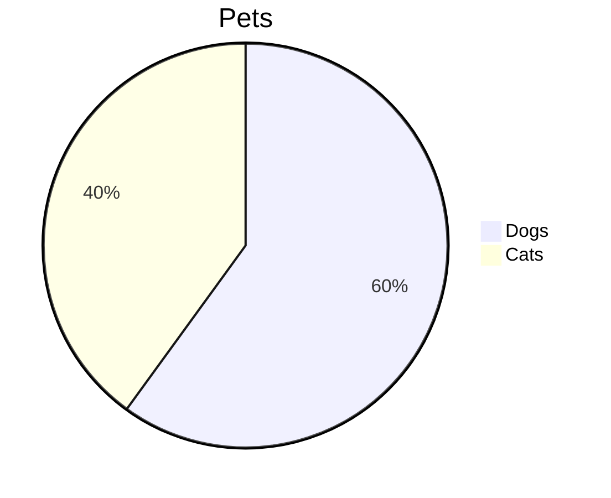

---
rfluence:
  title: rfluence merfluence API test
  url: https://tech-accounts11.atlassian.net/wiki/spaces/rfluencete/pages/458755
  space_key: rfluencete
  updated: 2026-10-04T02:06:35.847Z
  simplified: true
---

# rfluence merfluence API test

rfluence test page: checks whether merfluence renders diagrams created via the API. Safe to delete.

## A: source only

Expected: flowchart Alpha -\> Beta -\> Gamma

## B: source + default settings

Expected: sequence diagram Client -\> Server

## C: new source + stale cached SVGs

Expected if source wins: pie chart. Stale if it shows the Start/Is it?/Rethink flowchart.

