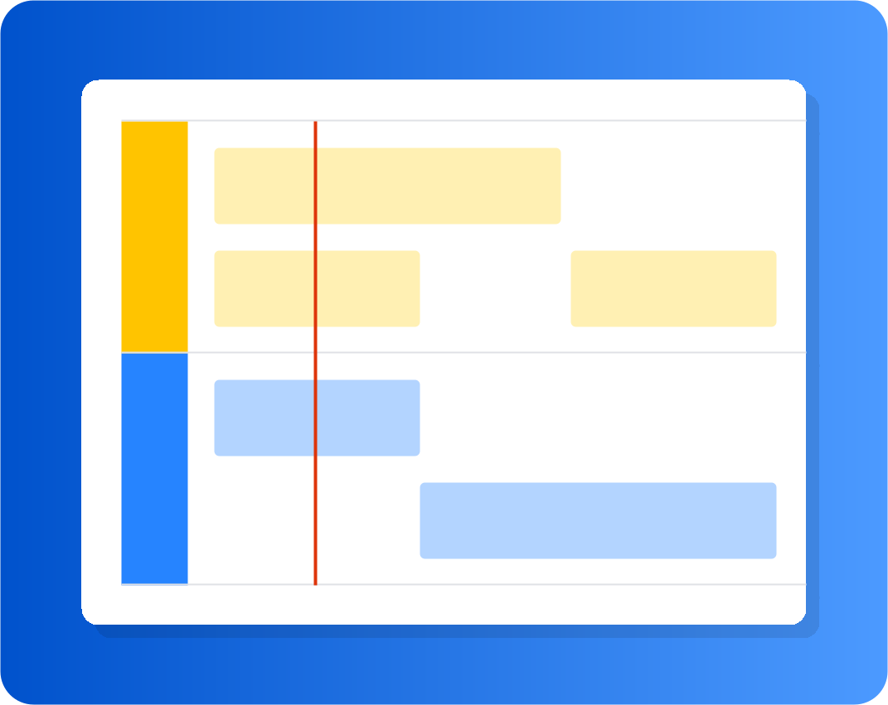

---
rfluence:
  id: "295257"
  space_key: rfluencete
  parent: "753877"
  version: 1
  url: https://tech-accounts11.atlassian.net/wiki/spaces/rfluencete/pages/295257
  labels: []
---

# Software development

```adf
{"type":"panel","attrs":{"panelColor":"#E3FCEF","panelType":"custom"},"content":[{"type":"heading","attrs":{"level":3},"content":[{"type":"text","text":"Welcome to your software project space!"}]},{"type":"bulletList","content":[{"type":"listItem","content":[{"type":"paragraph","content":[{"type":"text","text":"We've added some suggestions and placeholders. Everything is customizable."}]}]},{"type":"listItem","content":[{"type":"paragraph","content":[{"type":"text","text":"Get started with templates:"}]},{"type":"bulletList","content":[{"type":"listItem","content":[{"type":"paragraph","content":[{"type":"inlineCard","attrs":{"url":"https://tech-accounts11.atlassian.net/wiki/spaces/rfluencete/pages/295297"}}]}]},{"type":"listItem","content":[{"type":"paragraph","content":[{"type":"inlineCard","attrs":{"url":"https://tech-accounts11.atlassian.net/wiki/spaces/rfluencete/pages/295310"}}]}]},{"type":"listItem","content":[{"type":"paragraph","content":[{"type":"inlineCard","attrs":{"url":"https://tech-accounts11.atlassian.net/wiki/spaces/rfluencete/pages/295323"}}]}]}]}]}]}]}
```

### Status

*<span style="color: #97a0af">Write an update</span>*

### Jira issues

### Recently updated

<!-- rf: columns=50,50 -->

<!-- rf: layout=center -->

<!-- rf: column -->

<details><summary>Display a list of recently changed content</summary>

**To add the Recently updated element:**

1. When editing type /
2. Find Recently updated in the dropdown
3. Select **Insert**

**To edit the Recently updated element:**

1. Select the placeholder. The floating toolbar appears.
2. Select **Edit**. The right panel opens.
3. Modify the parameters. Your changes are saved as you go.
4. Resume editing and the panel closes.

</details>

<!-- rf: end-columns -->

### Roadmap

<!-- rf: columns=50,50 -->

<!-- rf: layout=center -->

<!-- rf: column -->

<details><summary>Adding a roadmap planner</summary>

Create simple, visual timelines that are useful for planning projects, software releases and much more.

Roadmaps are made up of:

- **bars** to indicate phases of work.
- **lanes** to differentiate between teams, products or streams.
- **markers** to highlight important dates and milestones.
- a **timeline** showing months or weeks.

You can provide more information about items on your roadmap by linking a bar to a page.

**To add the Roadmap planner:**

1. When editing type /
2. Find Roadmap planner in the dropdown
3. Select **Insert**

**To edit the Roadmap planner:**

1. Select the placeholder. The floating toolbar appears.
2. Select **Edit**. The right panel opens.
3. Modify the parameters. Your changes are saved as you go.
4. Resume editing and the panel closes.

</details>

<!-- rf: end-columns -->
