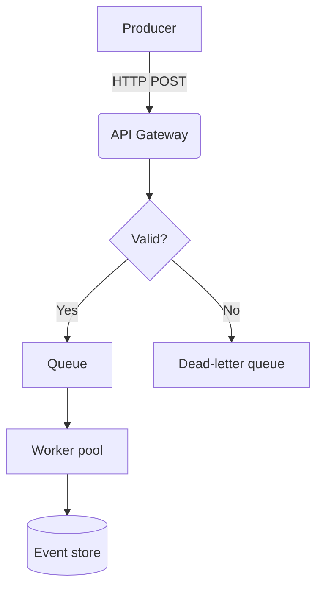
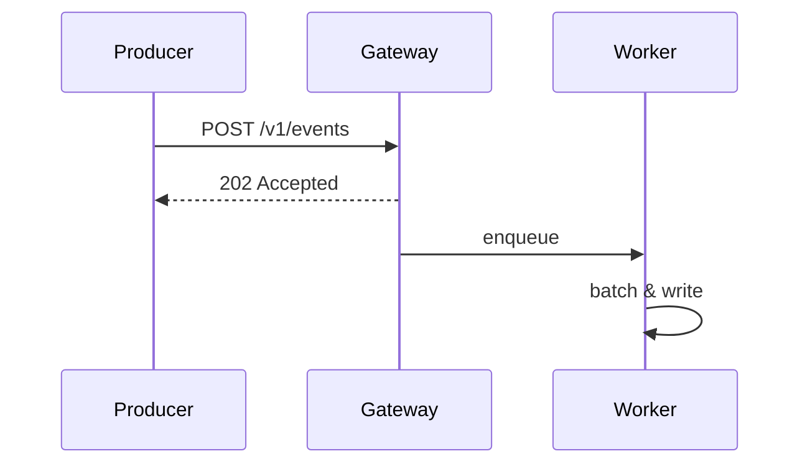

# Ingestion Service Architecture

## Overview

The ingestion service receives events from upstream producers, validates them, and writes them to the **event store**. It is designed for *at-least-once* delivery and horizontal scaling.

> [!NOTE]
> This document describes the target architecture for Q3. See [the current state](./current-state.md) for what is deployed today.

## Components



| Component | Responsibility | Owner | Language |
|-----------|----------------|-------|:--------:|
| API Gateway | Auth, rate limiting | Platform | Go |
| Validator | Schema checks using `jsonschema` | Ingestion | Rust |
| Worker pool | Batching and writes | Ingestion | Rust |
| Event store | Durable storage | Data | — |

### Request flow

1. The producer sends a batch to `POST /v1/events`.
2. The gateway checks the API key and applies the rate limit:
   - 1,000 requests/minute per key
   - 10 MB maximum body size
3. The validator checks each event against its schema.

   ```rust
   pub fn validate(event: &Event, schema: &Schema) -> Result<(), ValidationError> {
       schema.validate(&event.payload).map_err(ValidationError::from)
   }
   ```

4. Valid events are enqueued; invalid ones go to the DLQ with the error attached.

> [!WARNING]
> Workers must be idempotent. The queue can redeliver a message after a worker crash, so the same event may be written twice.

## Configuration

```yaml
ingestion:
  queue:
    url: amqp://queue.internal:5672
    prefetch: 100
  workers: 8
```

## Sequence



## Open questions

- [ ] Do we need exactly-once semantics for billing events?
- [x] Choose a queue technology (decided: RabbitMQ)
- [ ] Define the retention policy for the DLQ

See also: [Deployment](./deployment.md#rollout-strategy), [Request flow](#request-flow), and <https://example.atlassian.net/wiki/spaces/ENG/pages/123456>.
