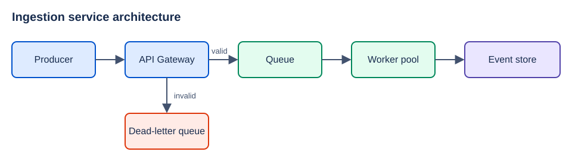
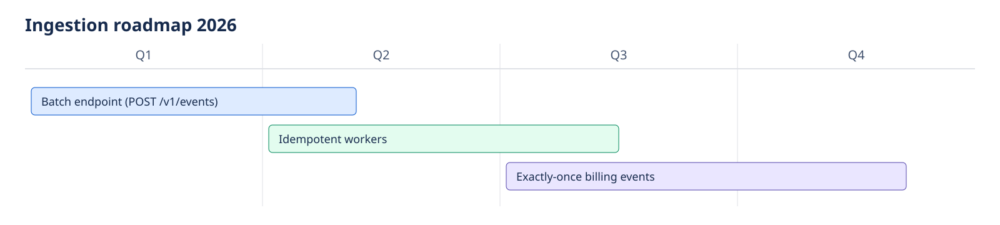

# Images and links

## Images

A default image, left-aligned at natural width, with no settings comment:

An image with non-default settings:

<!-- rf: layout=center width=1070 -->

An image with alt text:

An external image:

## Links

- Text link to a page: [Engineering home](https://example.atlassian.net/wiki/spaces/ENG/pages/123000)
- Relative markdown link: [setup guide](./setup.md)
- Relative link with anchor: [install step](./setup.md#install)
- Smart link (autolink): <https://example.atlassian.net/wiki/spaces/ENG/pages/123456>
- Bare URL (GFM autolink extension): https://example.com/docs
- Reference-style link: [the spec][spec]

An embedded video:

<https://www.youtube.com/watch?v=dQw4w9WgXcQ><!-- rf: card=embed width=100 -->

[spec]: https://example.com/spec "Specification"

## Table settings

| Quarter | Revenue |
| --- | --- |
| Q1 | 10 |
| Q2 | 12 |
<!-- rf: width=1200 -->

Text after the table.
